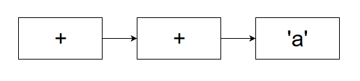
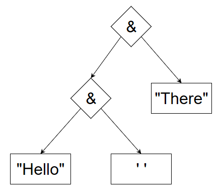
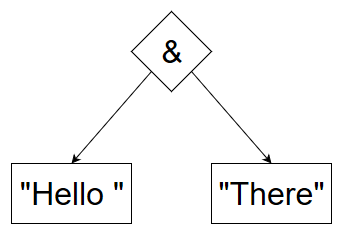
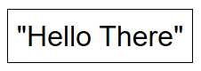

# Summary

**Stringier** is an implementation of **Pattern Combinators**, an approach to parser design in which you describe what to parse, not how to parse it, through combinatorics. Patterns are built up, or *combined*, into bigger patterns, and individual patterns can have modifiers attributed to them. This approach shares superficial similarities to **Parser Combinators** such as [Parsec](https://wiki.haskell.org/Parsec) and [Bennu](http://bennu-js.com/), and **Regular Expressions**. Many comparisons and analogies will be made to both of these to aide in explanation, demonstrate advantages, and put behavioral characteristics into context. **Stringier** was written primarily in **C#** although it is tested in **C#** and **VisualBasic**. There is also first class support for **F#** through extension libraries that are part of the main project. The general workings of **Pattern Combinators** are described. Finally extensive benchmarking is done and compared against similar approaches.

# Problem

No product should just exist because it can. **Stringier** was born out of solving a problem: Efficiently parsing text without requiring a deep knowledge of how parsers work, with as high degree of ease of usability as possible.

The requirements a solution must have:
  1) The user of a solution shouldn't not be required to understand what terms like "recursive-descent parser", "LALR(k)", "context-free", etc. mean. While theoretical understanding is beneficial, the user of a hammer doesn't need an understanding of material science or physics.
  2) The user of a solution shouldn't have to be aware of how to optimize the solution. Just as optimizing compilers have advanced considerably, optimization should be performed for the user, not by the user.
  3) The user should be able to reuse what they have done. Code reuse is highly recommended and widely agreed best practice. This is still code.

Several solutions to this problem were considered, but ultimately no match was found.

 * **Regex** met requirement 1, but failed at 2 and 3.
   1) You just describe the pattern.
   2) There's a lot of characteristics of **Regex** that newcomers especially aren't aware of. `()` isn't grouping. Well, it isn't _just_ grouping. `(?:)` needs to be used when a capture isn't required. This issue, and others, means users need to actively optimize their patterns, and are prone to performance pitfalls.
   3) The patterns are complete units, and when anchored with `^` or `$`, can not possibly be merged. While naively string concatenation can be performed, when tested this was extremely problematic. Furthermore, terminal modifiers like `/ig` or backreferences like `\1` make combinatorics limited and often impossible in practice.
 * **Parsec**, specifically [FParsec](http://www.quanttec.com/fparsec/) met requirement 1 and 3, but failed at 2.
   1) You describe the order of smaller parsers, but don't need to understand grammars for this.
   2) There is a wiki page explicitly about [optimization](http://www.quanttec.com/fparsec/users-guide/performance-optimizations.html).
   3) Parsers are combined into bigger parsers.
 * **Parser Generators** met 2 and 3, but failed abysmally at 1.
   1) Whether you use Bison, YACC, ANTLR, or others depends on the grammar you are parsing.
   2) Extremely good performance for the level of grammar you're parsing. While there's a few pitfalls it mostly does the right thing.
   3) These typically work through grammar definitions which refer to other lexical elements, being quite literally extensively reused.
   
With no obvious solution, work began on designing and programming one.

# Basics

The fundamental basis of this approach is that of the **Pattern**. This is very similar to how **Regex** works, where you define _what to parse_, not how to parse it. As long as this is maintained, requirement 1 is met. In **Stringier**, **Pattern** is implemented as an `abstract class`. All *types* of **Pattern** inherit from this `class`. Each of these implementations holds a reference to one or more **Pattern**, making **Pattern** both the node of a linked container, and the container itself. For this reason **Pattern Node** or **Node** will be used to refer to an individual member, and **Pattern** will be used to refer to the combined collection. The aforementioned links form an **decision tree**, this is where **Pattern Combinators** diverge extremely from **Regex**, which use **Finite-State Automata**. This is not a simple matter of storing data differently, as will be explained and demonstrated later.

**Pattern** is composed through two means: modifiers and combinators. Modifiers are methods that act upon a single **Pattern** and return a **Pattern*, with a head **Node** representing that modifier, which references the original **Pattern**. Combinators are methods that act upon two **Pattern** and return a single **Pattern**, with a head **Node** representing that combinator, which references the two original **Pattern**. This had an unintended effect when it comes to efficiency: memory usage. In this example, the resulting **Pattern** is a single **Node** which contains one or two references. That's it. Both of these are exposed through operator overloads in most cases, with static method calls handling situations where no operator intuitively makes sense. Operators are defined for the `abstract` **Pattern** `class`, which call `virtual` methods who's default implementation is to simply construct the corresponding **Node** and insert it at the head. These were made virtual so that specific overrides could be made, which will be discussed later.

# Decision Tree

As mentioned **Pattern** forms a **decision tree**. This is not an insignificant matter. In most cases this graph will visually represent a list or tree, which should hopefully emphasis the low complexity of most patterns.

Consider the Regex DoS pattern `/(a+)+/` which forms the following NFA:

The equivalent **Stringier** pattern `+(+'a')` forms the following DT:

Despite describing the same pattern and effectively parsing the same text, the underlying behavior is immensely different because of the structure and resulting control flow. This enables some convenient features.

## Self-Optimization

As alluded to earlier, users should not have to optimize their patterns, especially given how far optimizing compilers have come and the things we've learned from them.

Collapsing patterns is one of the most obvious optimizations. Not only does this further reduce memory usage, but is capable of improving speed by eliminating some dereferences, and allowing case-optimal parsing algorithms.

Consider the following pattern `"Hello" & ' ' & "there"` and it's DT:

As it turns out, parsing the result of `String` concatenation is faster than parsing the `Pattern` concatenation of two `String` literals. Because of this, we should replace any `Pattern` concatenation of `String` or `Char` literals with a single `String` literal who's value is the `String` concatenation of the two literals. This is where the aformentioned `virtual` methods come into play. `Concatenate()` is `overrides` for these literals, and instead, creates the following DT:

Notice how we now have the same situation, which means the same optimization can occur, creating the final DT:

This is a trivial example but these optimizations occur elsewhere, such as alternates of alternates (of of many), and others. As more are uncovered, these optimizations are put into place. Because these are optimizations the engine makes at object construction time, patterns never need to be changed because of optimal discoveries; they will happen when updated.

The user does not need to understand how to keep a pattern optimal, meeting requirement 2.

## Saftey

Not all patterns are viable, similar to the ReDoS issue. However, those `virtual` methods are handy in this regard as well. When certain problematic patterns are constructed, an exception can be thrown well before running the parser, outright preventing the DoS.

This implementation does not currently have a Kleene Star `*` and relies on the composition of two modifiers `+` and `-`. However their behavior depends on the order. `-+` is the correct order for the behavior of the Kleene Star, the `+` making the pattern repeating, and the `-` making the repeating pattern optional. `+-` however would be a DoS, specifically because it creates an infinite loop. `-` makes the pattern optional, and then `+` makes the optional pattern repeating; because an optional pattern does not need to be present, eventually the pattern gets to where a match does not occur and repeats infinitely at that point. Except that this never happens. This mistake is caught at construction time through the same graph rewriting mechanism, which means there's no added performance hit for this feature.

The user does not need to understand potential security issues; while this wasn't a requirement, it's a very welcome benefit.

## Conclusion

This approach holds great potential, and is considered a success. Usability is great, with notable improvements over other approaches. Ease of use is substantial, and done in-language so it does not require additional tooling. Additional work is being done on expanding this to support left-recursion, which is possible in this approach, and is just a matter of finding the most optimal mechanism. Furthermore, work is being done on extending this to a domain-specific language to easily and rapidly generate lexers for full languages. And lastly, a comprehensive performance analysis is coming soon.